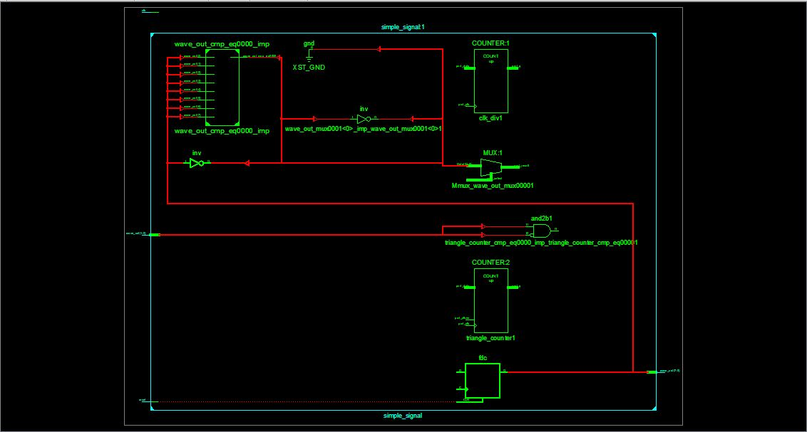
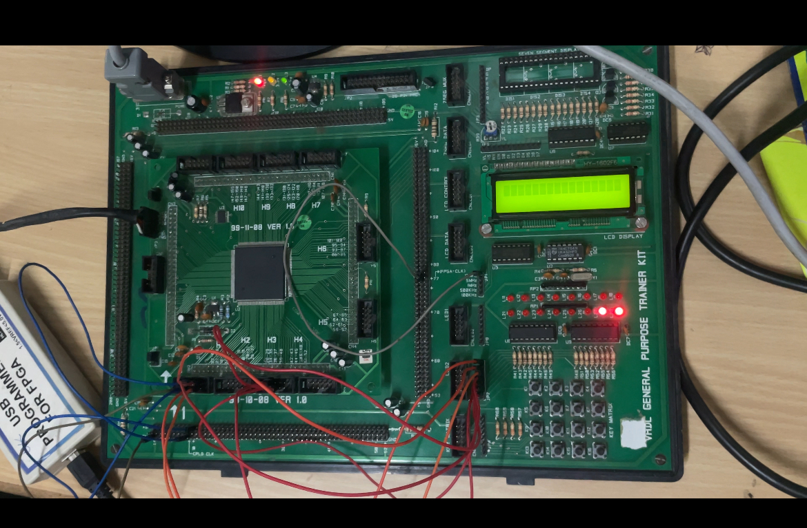
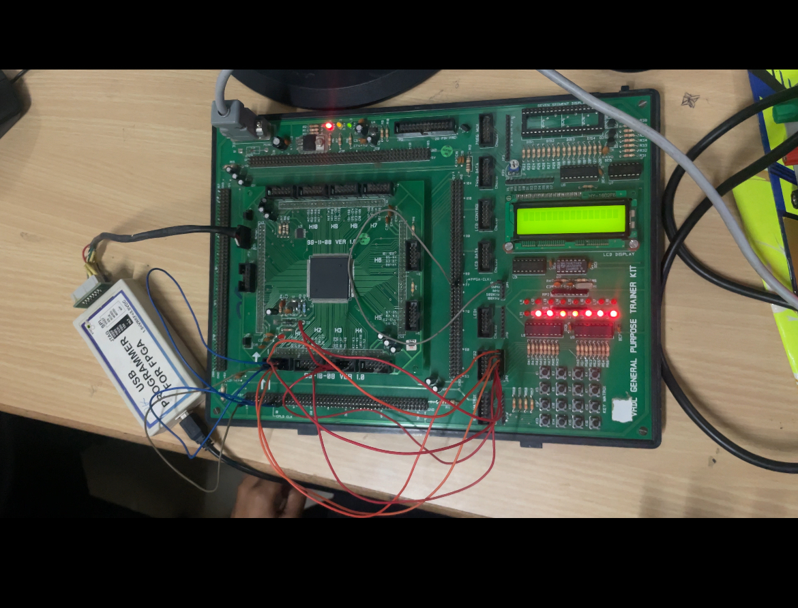

# FPGA Signal Generator using Verilog

A basic signal generator module written in Verilog, implemented on an FPGA board. This project was developed as part of an experiential learning course in the ECE department at Cambridge Institute of Technology.

## Features
- 3 waveform modes:
  - `00` → Square wave
  - `01` → Rectangular wave (10101010 ↔ 01010101)
  - `10` → Triangle wave (ramping counter)
- Clock divider for visible LED display
- Switch-selectable waveform modes
- Synchronous reset functionality

## Technical Details
- **Language**: Verilog
- **FPGA Tool**: Xilinx
- **Clock Divider**: 24-bit, slow_clk derived from clk[23]
- **Wave Output**: 8-bit LEDs

## Output
### RTL Schematic
> ## RTL Schematic

> ## output from Spartan3 kit

### FPGA LED Output
- **Square Wave**: LEDs blink ON/OFF 11111111 ↔ 00000000 pattern
- **Rectangular Wave**: Alternating 10101010 ↔ 01010101 pattern
- **Triangle Wave**: Incremental LED counts

